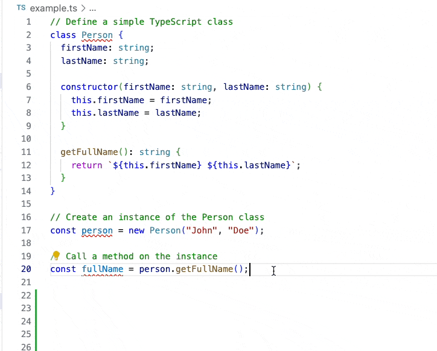

# VS Code Snippet: Clo With File Prefix

## Overview

This Visual Studio Code (VS Code) snippet is designed to streamline your coding experience by automatically generating a `console.log` statement with a filename prefix. It's a variation of the popular `clo` snippet from the `dsznajder.es7-react-js-snippets` extension.

With this snippet, you can quickly insert a line like this:

```javascript
console.log("👀 [filename.ts:21]: variable", variable);
```

- `filename.ts` is dynamically replaced with the actual filename.
- You can easily replace variable with your own variable to log.
- An emoji is included for better readability.

## Usage

In your VS Code editor, simply type `clop` to trigger this helpful snippet.

Enjoy simplified debugging with automatic filename prefixes for your console.log statements!


